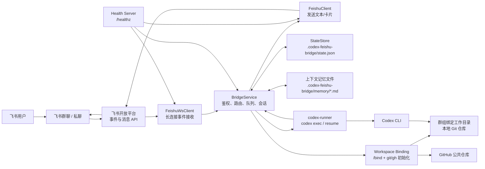
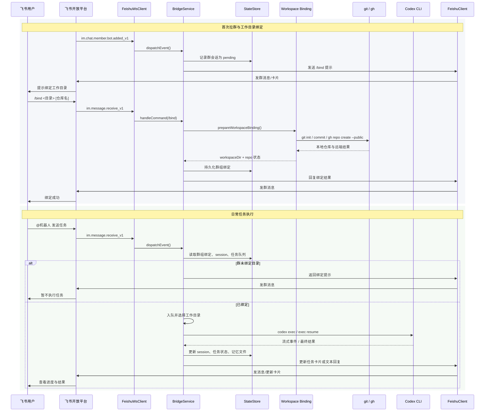

# Codex Feishu Bridge

一个运行在本地机器上的桥接服务：通过飞书长连接接收机器人事件，把聊天消息转成 `codex exec` / `codex exec resume` 任务，再把执行进度和结果发回飞书。

它适合这样的场景：

- 你希望在飞书里直接驱动本机上的 Codex CLI
- 你希望按聊天维度复用 Codex session，而不是每条消息都开新上下文
- 你希望群组能绑定到固定工作目录，并在首次绑定时顺手初始化 Git / GitHub 仓库

# 效果图


## 你会得到什么

- 私聊或群聊里通过文本直接下发 Codex 任务
- 同一聊天自动复用 Codex session
- 群聊首次接入后，先通过 `/bind <工作目录> [仓库名]` 绑定固定工作目录
- `/bind` 只能绑定到 `WORKSPACE_ALLOWED_ROOTS` 允许的目录范围内
- 绑定时自动准备本地 Git 仓库，并尝试通过已登录的 `gh` CLI 创建 GitHub 公共仓库
- 任务过程通过飞书共享卡片持续更新，支持 `/abort`、`/retry`、`/reset`
- 当 Codex 需要你做方案选择时，Bridge 会持久化选项并提示你使用 `/choose <选项ID>` 继续
- 本地持久化聊天状态、排队任务、上下文记忆和重启恢复信息
- 可选任务完成后自动 Git 提交

## 适用前提

- Node.js 18.18 或更高版本
- 本机已安装 `codex`
- 已有一个飞书企业自建应用，并能开启机器人能力
- 如果要自动创建 GitHub 公共仓库，本机还需要安装并登录 `gh`

## 3 分钟上手

### 1. 安装依赖

```bash
npm install
```

### 2. 生成 `.env`

```bash
npm run setup
```

向导会生成或补全项目根目录下的 `.env`。

默认会把 `WORKSPACE_ALLOWED_ROOTS` 设为 `CODEX_WORKSPACE_DIR`，表示群组只能绑定到这个根目录及其子目录。需要放开额外目录时，再显式配置白名单。

### 3. 在飞书后台完成订阅配置

至少开启这些项：

1. 机器人能力
2. 事件 `im.message.receive_v1`
3. 事件 `im.chat.member.bot.added_v1`
4. 订阅方式选择“使用长连接接收事件/回调”

### 4. 启动服务

```bash
npm start
```

### 5. 验证健康检查

默认端口示例：

```bash
curl http://127.0.0.1:3000/healthz
```

如果你在 `.env` 里改了 `PORT`，这里也要跟着改。

### 6. 在飞书里验证

- 私聊机器人，直接发送文本任务
- 把机器人拉进群
- 机器人第一次进群后会提示先执行 `/bind`
- 在群里绑定成功后，再 `@机器人` 发送任务

## 典型使用流程

### 私聊

1. 用户发送文本消息
2. Bridge 创建或恢复这个私聊对应的 Codex session
3. Codex 在默认工作目录执行任务
4. 结果通过文本或卡片回到飞书

### 群聊

1. 机器人首次被拉进群，收到 `im.chat.member.bot.added_v1`
2. Bridge 提示群里先执行 `/bind <工作目录> [仓库名]`
3. `/bind` 成功后，把这个群与本地目录持久化绑定
4. 这个群后续所有任务都固定在该目录执行
5. `/reset` 只清空 session，不取消目录绑定

如果目录路径里有空格，可以这样写：

```bash
/bind "/vol3/1000/workspace/Project A" project-a
```

## 实现方案

### 系统架构图



### 整体交互图



## 项目结构

主要代码都在 `src/`：

- `src/index.js`: 进程入口，启动配置、健康检查、飞书长连接
- `src/bridge-service.js`: 事件分发、聊天路由、任务队列、命令处理、状态更新
- `src/codex-runner.js`: 启动和取消 `codex exec`
- `src/feishu-client.js`: 调飞书 HTTP API 发送消息、更新卡片
- `src/feishu-ws-client.js`: 建立飞书长连接并分发事件
- `src/state-store.js`: 持久化聊天状态和运行时快照
- `src/workspace-binding.js`: `/bind` 目录绑定、Git 初始化、GitHub 仓库创建
- `src/git-commit.js`: 可选自动提交与回滚
- `src/init-guide.js`: `npm run setup` 初始化向导

持久化数据默认保存在：

- `.codex-feishu-bridge/state.json`
- `.codex-feishu-bridge/memory/`
- `.codex-feishu-bridge/bridge.log`

## 功能清单

### 消息与会话

- 支持私聊文本消息
- 支持群聊 `@机器人` 文本消息
- 支持按聊天维度复用 Codex session
- 支持回复原消息，减少群聊串线

### 群组绑定

- 机器人首次进群时自动提示绑定目录
- `/bind <工作目录> [仓库名]` 持久化绑定当前群目录
- 后续群任务都强制使用该目录
- 已有 `origin` 时沿用已有远端

### 任务执行

- 同一聊天串行执行，不同聊天按配置并行
- 支持排队、取消、失败、中断恢复
- 支持 `/abort <任务号>`
- 支持 `/retry [任务号]`
- 支持 `/reset`
- 支持 `/status`
- 支持 `/choose <选项ID>` 继续等待用户选择的任务

### 结果回传

- 支持共享卡片持续更新任务状态
- 支持命令执行过程流式回传
- 支持任务完成后回写结果摘要
- 支持通过 `codex_bridge_interaction` 协议把“需要用户选择”的场景转成文本选择指令

### 选择交互

- 当 Codex 判断需要你确认方案时，会输出一个 `codex_bridge_interaction` JSON 代码块
- Bridge 会把问题、选项、session、工作目录一起持久化，并发送 `/choose <选项ID>` 提示
- 你用 `/choose` 后，Bridge 不会把“我选了 B”交给模型猜，而是直接用预存的后续 prompt 继续当前 session

### 上下文管理

- 本地持久化 session 与任务快照
- 重启后恢复排队任务和中断任务信息
- 上下文接近上限时自动压缩记忆

### Git 能力

- 群绑定时自动初始化本地 Git 仓库
- 尝试自动创建 GitHub 公共仓库
- 可选任务结束后自动 Git 提交

## 配置说明

在项目根目录创建 `.env`。

下面是一份推荐起步配置：

```dotenv
FEISHU_APP_ID=cli_xxx
FEISHU_APP_SECRET=xxx
FEISHU_BOT_OPEN_ID=ou_xxx

PORT=3000

FEISHU_ALLOWED_OPEN_IDS=

CODEX_WORKSPACE_DIR=/home/you/workspace/default-project
WORKSPACE_ALLOWED_ROOTS=/home/you/workspace
GITHUB_REPO_OWNER=
CHAT_WORKSPACE_MAPPINGS=
CODEX_COMMAND=codex
CODEX_MODEL=
CODEX_PROFILE=

AUTO_COMMIT_AFTER_TASK_ENABLED=false
AUTO_COMMIT_MESSAGE_PREFIX="bridge: save"
```

上面这组配置已经足够覆盖现有功能。其余行为参数现在都有稳定默认值，除非你明确要调优，否则不建议继续往 `.env` 里堆更多开关。

### 关键配置项解释

#### 飞书相关

- `FEISHU_APP_ID` / `FEISHU_APP_SECRET`: 飞书应用凭据，必填
- `FEISHU_BOT_OPEN_ID`: 群里需要精确判断是否 `@` 到机器人时建议填写
- `FEISHU_ALLOWED_OPEN_IDS`: 限制允许使用机器人的用户，不填则不限制

#### Codex 相关

- `CODEX_WORKSPACE_DIR`: 默认工作目录，私聊和未单独映射的聊天会用它
- `WORKSPACE_ALLOWED_ROOTS`: 允许 `/bind` 使用的目录根路径，默认应至少覆盖 `CODEX_WORKSPACE_DIR`
- `CODEX_COMMAND`: Codex 启动命令，默认直接使用 `codex`
- `CODEX_MODEL` / `CODEX_PROFILE`: 需要固定模型或 profile 时再填

#### 群组目录绑定相关

- `GITHUB_REPO_OWNER`: `/bind` 创建 GitHub 仓库时使用的 owner；不填则使用当前 `gh` 登录用户
- `CHAT_WORKSPACE_MAPPINGS`: 静态聊天目录映射，格式为 `chatKey=/abs/path;chat_id=/abs/path`

#### 自动提交相关

- `AUTO_COMMIT_AFTER_TASK_ENABLED=true` 时，每个任务结束后尝试自动 `git add -A && git commit`
- 打开后会强制串行，避免多个任务同时改同一工作区

#### 兼容说明

- 历史上的细粒度调优项仍然兼容读取，例如请求超时、流式输出、上下文压缩阈值、并发限制、Codex sandbox / approval 等。
- 这些项不再是推荐配置面，因为默认值已经足够覆盖当前功能；只有在你明确需要调优时，才建议继续使用旧键。

## 飞书后台配置步骤

按这个顺序配置最省事：

1. 创建企业自建应用
2. 开启机器人能力
3. 安装应用到企业
4. 在“事件与回调”里添加：
   - `im.message.receive_v1`
   - `im.chat.member.bot.added_v1`
5. 把订阅方式切到“使用长连接接收事件/回调”
6. 确保机器人能被私聊，或者能在群里被 `@`

如果你要用 `/bind` 自动创建 GitHub 公共仓库，还要先在桥接服务机器上执行：

```bash
gh auth login
```

## 使用方式

### 基础命令

- `/help`: 查看帮助
- `/bind <工作目录> [仓库名]`: 绑定当前群组工作目录并尝试初始化公共仓库
- `/status`: 查看当前聊天状态、目录、session、排队情况
- `/reset`: 清空当前聊天 session，保留目录绑定
- `/abort <任务号>`: 终止运行中的任务，或取消排队任务
- `/retry [任务号]`: 重试中断任务

### 群组绑定示例

```text
/bind /vol3/1000/workspace/project-a project-a
```

含义：

- 当前群后续任务固定在 `/vol3/1000/workspace/project-a`
- 仓库名使用 `project-a`
- 如果目录不是 Git 仓库，会自动初始化
- 如果还没有 `origin`，会尝试创建 GitHub 公共仓库并推送

## 启动与运维

### 本地开发

```bash
npm run dev
```

### 生产式启动

```bash
npm start
```

### 健康检查

```bash
curl http://127.0.0.1:${PORT}/healthz
```

健康检查会返回：

- 当前会话数
- 排队和运行中的任务数
- 中断任务数
- 飞书 HTTP / WS 指标
- 最近重连信息

### 查看日志

如果你按项目约定把输出重定向到日志文件，可以查看：

```bash
tail -f .codex-feishu-bridge/bridge.log
```

## 常见问题

### 1. 群里发消息没反应

优先检查：

- 是否已经 `@` 到机器人
- 是否开启了 `FEISHU_REQUIRE_MENTION_IN_GROUP`
- 飞书后台是否已订阅 `im.message.receive_v1`
- 订阅方式是否确实是长连接

### 2. 群里一直提示先 `/bind`

说明当前群还没有工作目录绑定，或者绑定信息被清掉了。直接执行：

```text
/bind /你的工作目录 仓库名
```

### 3. `/bind` 失败

通常是这些原因：

- 目录路径无效
- `git commit` 失败，本机没配置 `user.name` / `user.email`
- `gh` 未登录
- GitHub 上仓库名已存在且当前账号无权创建

### 4. 健康检查访问不到

检查：

- `.env` 里的 `HOST` 和 `PORT`
- 服务是否已成功启动
- 是否打到了错误端口

### 5. 任务执行一半后服务重启了

Bridge 会把运行快照写到 `.codex-feishu-bridge/state.json`。重启后：

- 排队任务会恢复
- 运行中的任务会被标记为中断
- 可以在飞书里用 `/retry` 重新入队

## 安全边界

- Bridge 会自动给 Codex 注入前导指令
- 默认约束为：删除类操作前必须明确确认
- 可以通过 `FEISHU_ALLOWED_OPEN_IDS` 限制使用者
- 默认使用 `CODEX_APPROVAL_POLICY=never` 和 `CODEX_SANDBOX=workspace-write`

## 当前限制

- 当前只支持文本消息
- 当前依赖飞书后台已切到长连接模式
- 任务执行结果主要通过共享卡片汇总，不会为每次状态变化都发送新消息

## 测试

运行测试：

```bash
npm test
```

当前仓库已包含基础测试，覆盖了：

- Bridge 路由与任务队列
- Codex runner 的取消逻辑
- Feishu HTTP / WS 客户端
- 初始化向导
- Git 自动提交

## 测试记录

- 已用真实飞书凭据成功调用 `auth/v3/tenant_access_token/internal`
- 已用真实飞书凭据成功调用 `/callback/ws/endpoint`
- 已本地启动长连接客户端，状态页返回 `transport: "feishu-ws"`
- 还没有用真实飞书聊天消息做最终回路验证；这一步依赖应用在飞书后台已开启长连接订阅，并且机器人已安装且可收消息

## 后续可扩展方向

- 增加更细粒度的工作目录路由规则，例如按用户或按消息前缀切换
- 增加自动 push / PR 工作流，但和自动 commit 解耦
- 增加任务历史查询与卡片归档
- 增加更多消息类型支持
